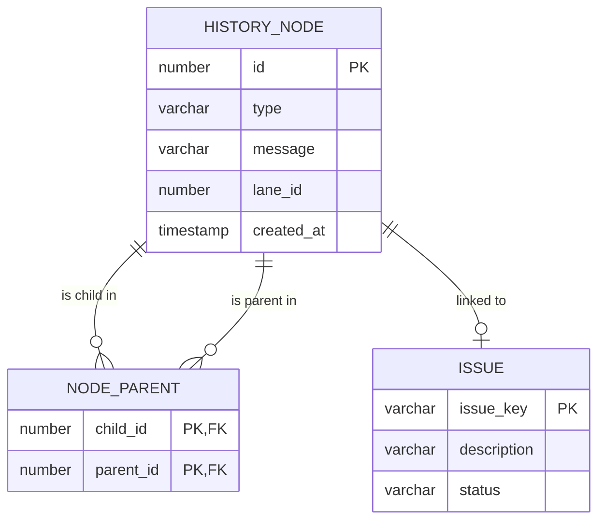

# Data Architecture Design: Work History Graph

This document outlines an RDB-friendly schema (Oracle compatible) and the DTO logic required to transform relational data into the graph format used by the frontend.

## 1. Relational Database Schema (Oracle)

We need three main tables to represent a Directed Acyclic Graph (DAG) structure in SQL.

### ER Diagram


### Table DDL (Oracle SQL)

```sql
-- 1. Main Table: Stores every "dot" in the graph
CREATE TABLE HISTORY_NODE (
    NODE_ID      NUMBER(19) GENERATED BY DEFAULT AS IDENTITY PRIMARY KEY,
    NODE_TYPE    VARCHAR2(20) NOT NULL, -- 'TASK', 'REVISION', 'MERGE', 'ISSUE'
    NODE_NAME    VARCHAR2(100) NOT NULL, -- The "Task Name"
    DESCRIPTION  VARCHAR2(500),          -- The "Task Description"
    MESSAGE      VARCHAR2(255) NOT NULL, -- The "Update Reason"
    LANE_INDEX   NUMBER(5) DEFAULT 0,   -- Visual lane (0=Main, 1=Rev A...)
    ISSUE_KEY    VARCHAR2(50),          -- Optional link to Issue tracker
    CREATED_AT   TIMESTAMP DEFAULT CURRENT_TIMESTAMP
);

-- 2. Relationships: Many-to-Many self-reference
-- Allows a node to have multiple parents (merges) and multiple children (branches)
CREATE TABLE NODE_PARENT (
    CHILD_ID     NUMBER(19) NOT NULL,
    PARENT_ID    NUMBER(19) NOT NULL,
    CONSTRAINT PK_NODE_PARENT PRIMARY KEY (CHILD_ID, PARENT_ID),
    CONSTRAINT FK_CHILD FOREIGN KEY (CHILD_ID) REFERENCES HISTORY_NODE(NODE_ID),
    CONSTRAINT FK_PARENT FOREIGN KEY (PARENT_ID) REFERENCES HISTORY_NODE(NODE_ID)
);

-- 3. Issues (External or Internal table)
CREATE TABLE ISSUE (
    ISSUE_KEY    VARCHAR2(50) PRIMARY KEY, -- e.g. 'JIRA-101'
    DESCRIPTION  VARCHAR2(1000),
    STATUS       VARCHAR2(20)
);
```

---

## 2. DTO Layer (Transformation Logic)

The frontend expects a specific JSON structure. This layer in your backend (Node.js/Java/Python) converts the SQL result set.

**Target Frontend Format:**
```json
[
  { "id": "c3", "lane": 1, "parents": ["c2"], "name": "Login UI", "description": "...", "message": "Rev A", ... }
]
```

### Transformation Strategy

1.  **Fetch Nodes**: `SELECT * FROM HISTORY_NODE`
2.  **Fetch Edges**: `SELECT * FROM NODE_PARENT`
3.  **Map & Combine**:

### Implementation Example (Node.js)

```javascript
/* 
 * DTO Service
 * Converts raw DB rows/entities into GraphNode objects
 */

async function getGraphData() {
    // 1. Fetch Data (mocking DB calls)
    const nodes = await db.execute("SELECT * FROM HISTORY_NODE ORDER BY CREATED_AT ASC");
    const edges = await db.execute("SELECT * FROM NODE_PARENT");

    // 2. Map Edges by Child ID for O(1) lookup
    // Map<ChildID, ParentID[]>
    const parentMap = new Map();
    edges.forEach(row => {
        if (!parentMap.has(row.CHILD_ID)) {
            parentMap.set(row.CHILD_ID, []);
        }
        parentMap.get(row.CHILD_ID).push(row.PARENT_ID);
    });

    // 3. Transform to DTO
    const graphData = nodes.map(row => {
        return {
            id: row.NODE_ID.toString(),       // Frontend typically expects strings
            lane: row.LANE_INDEX,             // Visual column index
            parents: parentMap.get(row.NODE_ID) || [], // Resolve parents array
            name: row.NODE_NAME,
            description: row.DESCRIPTION,
            message: row.MESSAGE,
            type: row.NODE_TYPE.toLowerCase(), // 'task', 'revision', etc.
            date: row.CREATED_AT.toISOString().split('T')[0],
            issueId: row.ISSUE_KEY || null
        };
    });

    return graphData;
}
```

### Advanced: Auto-Calculating Lanes
If you don't want to store `LANE_INDEX` in the DB manually, you can calculate it in the DTO layer using a "Graph Traversal" algorithm:
1.  Assign Lane 0 to the first node.
2.  When a node has multiple children, keep one on Lane 0, assign new Lanes to others.
3.  When nodes merge, terminate the higher lane.


---

## 3. Java / Spring Boot Implementation

Here is a reference implementation using **Spring Boot 3**, **Spring Data JPA**, and **Lombok**.

### 1. Entities (JPA)

**HistoryNode.java**
```java
@Entity
@Table(name = "HISTORY_NODE")
@Data
public class HistoryNode {
    @Id
    @GeneratedValue(strategy = GenerationType.IDENTITY)
    private Long nodeId;

    @Column(nullable = false)
    private String nodeType; // TASK, REVISION, etc.

    @Column(nullable = false)
    private String nodeName;

    private String description;

    @Column(nullable = false)
    private String message;

    private Integer laneIndex;

    private String issueKey;

    private LocalDateTime createdAt;
    
    // Establishing the Many-to-Many self-relationship manually or via @ManyToMany
    // For DTO performance, we often query relationships separately, but here is the JPA way:
    @ManyToMany(fetch = FetchType.LAZY)
    @JoinTable(
        name = "NODE_PARENT",
        joinColumns = @JoinColumn(name = "CHILD_ID"),
        inverseJoinColumns = @JoinColumn(name = "PARENT_ID")
    )
    private List<HistoryNode> parents;
}
```

### 2. DTO Class

**GraphNodeDTO.java** (Frontend Contract)
```java
@Data
@Builder
public class GraphNodeDTO {
    private String id;
    private Integer lane;
    private List<String> parents;
    private String name;
    private String description;
    private String message;
    private String type;
    private String date;
    private String issueId;
}
```

### 3. Service Layer (Logic)

**GraphService.java**
```java
@Service
@RequiredArgsConstructor
public class GraphService {

    private final HistoryNodeRepository repository;
    private final NodeParentRepository parentRepository; // Optional if using raw SQL for edges

    @Transactional(readOnly = true)
    public List<GraphNodeDTO> getGraphData() {
        // 1. Fetch all nodes (Joined fetch if dataset is small, or 2 queries for large datasets)
        List<HistoryNode> nodes = repository.findAllByOrderByCreatedAtAsc();
        
        // 2. Transform to DTO
        return nodes.stream().map(this::convertToDTO).collect(Collectors.toList());
    }

    private GraphNodeDTO convertToDTO(HistoryNode node) {
        return GraphNodeDTO.builder()
            .id(node.getNodeId().toString())
            .lane(node.getLaneIndex())
            .message(node.getMessage())
            .type(node.getNodeType().toLowerCase())
            .date(node.getCreatedAt().toLocalDate().toString())
            .issueId(node.getIssueKey())
            // Extract Parent IDs properly
            .parents(node.getParents().stream()
                .map(p -> p.getNodeId().toString())
                .collect(Collectors.toList()))
            .build();
    }
}
```

### 4. Controller

**GraphController.java**
```java
@RestController
@RequestMapping("/api/graph")
@RequiredArgsConstructor
public class GraphController {
    
    private final GraphService graphService;

    @GetMapping
    public ResponseEntity<List<GraphNodeDTO>> getHistory() {
        return ResponseEntity.ok(graphService.getGraphData());
    }
}
```

---

## 4. Java / Spring Boot Implementation (MyBatis)

If you prefer **MyBatis** over JPA, here is how you can implement the Data Access Layer.

### 1. Mapper Interface

**HistoryNodeMapper.java**
```java
@Mapper
public interface HistoryNodeMapper {
    // Fetches all nodes with their parents joined
    List<HistoryNode> findAllWithParents();
}
```

### 2. Mapper XML (`HistoryNodeMapper.xml`)

We use a `resultMap` to handle the `collection` of parents. To avoid N+1 issues, we join the `NODE_PARENT` table.

```xml
<?xml version="1.0" encoding="UTF-8" ?>
<!DOCTYPE mapper PUBLIC "-//mybatis.org//DTD Mapper 3.0//EN" "http://mybatis.org/dtd/mybatis-3-mapper.dtd">

<mapper namespace="com.example.graph.mapper.HistoryNodeMapper">

    <resultMap id="HistoryNodeResultMap" type="com.example.graph.entity.HistoryNode">
        <id property="nodeId" column="NODE_ID" />
        <result property="nodeType" column="NODE_TYPE" />
        <result property="nodeName" column="NODE_NAME" />
        <result property="description" column="DESCRIPTION" />
        <result property="message" column="MESSAGE" />
        <result property="laneIndex" column="LANE_INDEX" />
        <result property="issueKey" column="ISSUE_KEY" />
        <result property="createdAt" column="CREATED_AT" />
        
        <!-- Map the One-To-Many (Parents) relationship -->
        <collection property="parents" ofType="com.example.graph.entity.HistoryNode">
            <id property="nodeId" column="PARENT_ID" />
            <!-- We only need the ID for the DTO, but you could map other parent fields here if needed -->
        </collection>
    </resultMap>

    <select id="findAllWithParents" resultMap="HistoryNodeResultMap">
        SELECT 
            n.NODE_ID,
            n.NODE_TYPE,
            n.NODE_NAME,
            n.DESCRIPTION,
            n.MESSAGE,
            n.LANE_INDEX,
            n.ISSUE_KEY,
            n.CREATED_AT,
            np.PARENT_ID
        FROM 
            HISTORY_NODE n
        LEFT JOIN 
            NODE_PARENT np ON n.NODE_ID = np.CHILD_ID
        ORDER BY 
            n.CREATED_AT ASC
    </select>

</mapper>
```

### 3. Service Layer (MyBatis Version)

**GraphService.java**
```java
@Service
@RequiredArgsConstructor
public class GraphService {

    private final HistoryNodeMapper mapper;

    public List<GraphNodeDTO> getGraphData() {
        List<HistoryNode> nodes = mapper.findAllWithParents();
        
        return nodes.stream().map(node -> GraphNodeDTO.builder()
            .id(node.getNodeId().toString())
            .lane(node.getLaneIndex())
            .message(node.getMessage())
            .type(node.getNodeType().toLowerCase())
            .date(node.getCreatedAt().toLocalDate().toString())
            .issueId(node.getIssueKey())
            // Null check for parents list just in case
            .parents(node.getParents() == null ? Collections.emptyList() : 
                     node.getParents().stream()
                        .map(p -> p.getNodeId().toString())
                        .collect(Collectors.toList()))
            .build()
        ).collect(Collectors.toList());
    }
}
```
